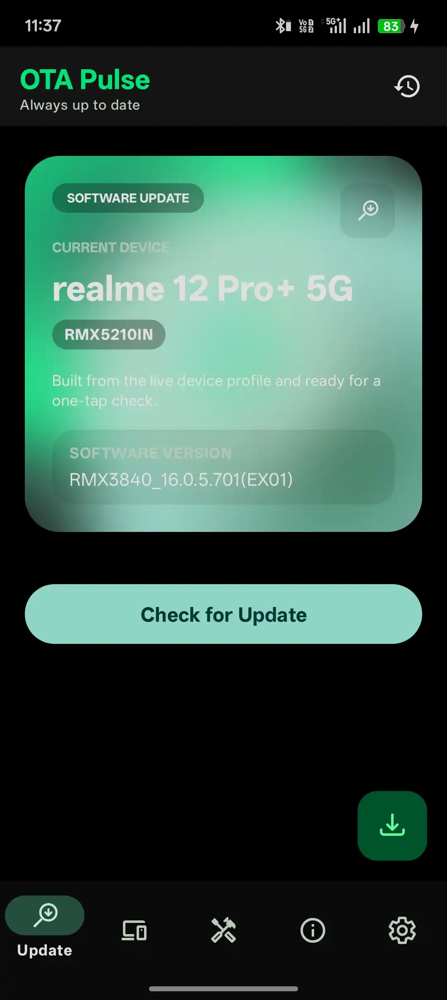
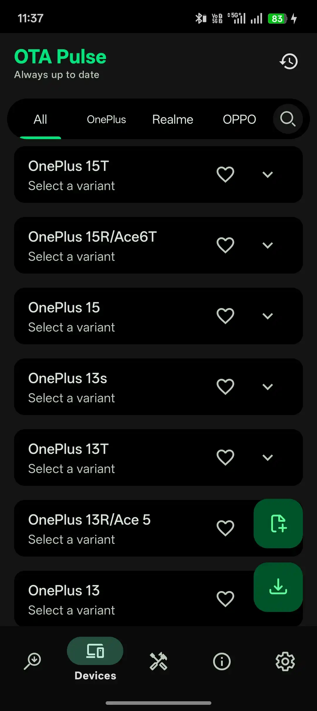
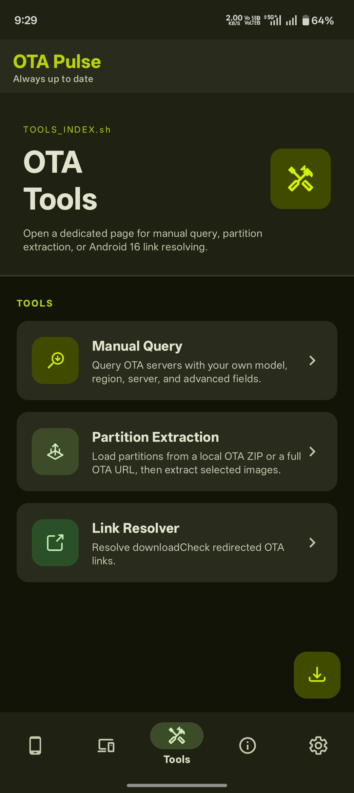
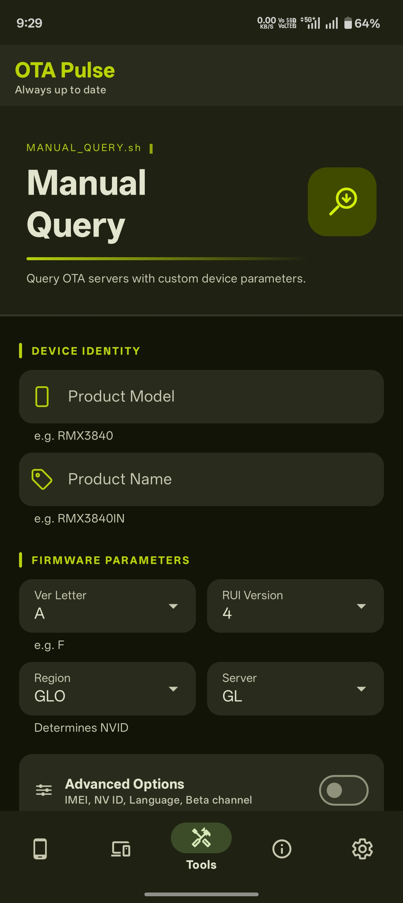
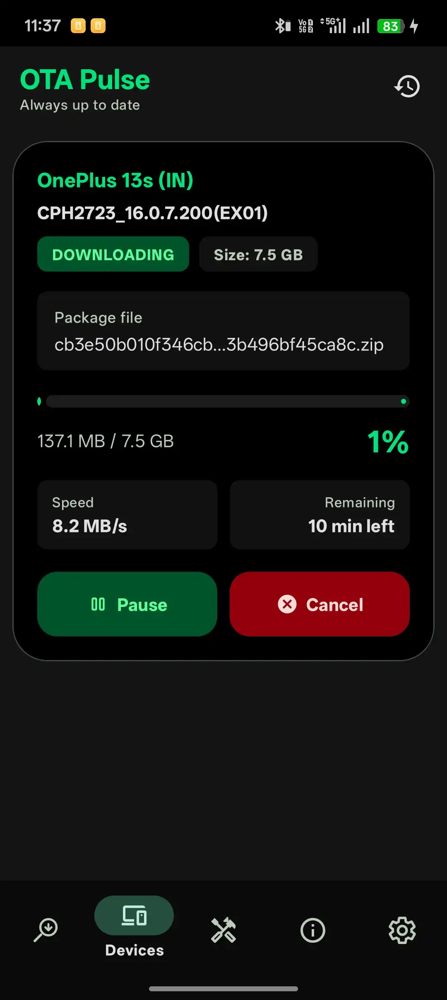
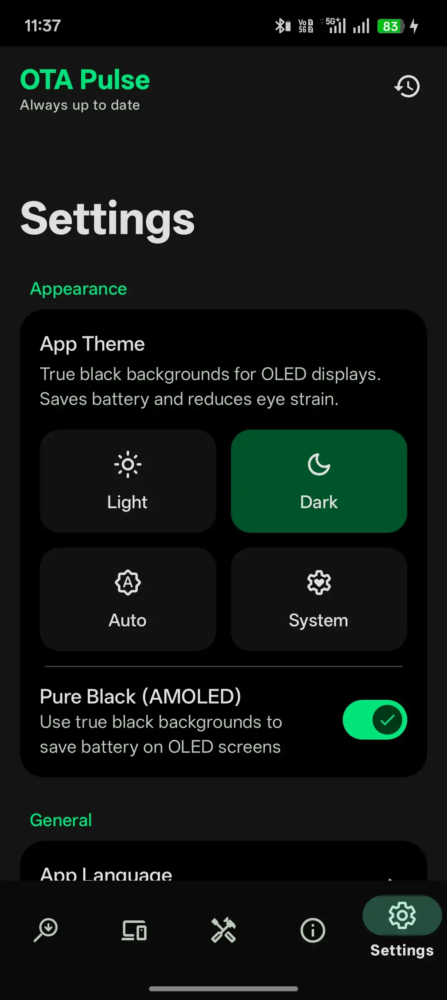

# OTA Pulse

OTA Pulse is an Android app for discovering, downloading, and inspecting OTA packages for supported `OnePlus`, `Realme`, and `OPPO` devices. This repository also includes a static landing page at [index.html](https://remurusama.github.io/OTA-Pulse/).

> Request and download OTA packages from BBK server(s).

## What the App Does

- Browse supported devices from built-in JSON catalog (144+ device definitions across OnePlus, Realme, and OPPO)
- Mark favorite devices for quick access
- Fetch and view OTA update metadata
- Download OTA packages with progress notifications (custom OkHttp download engine)
- Inspect OTA links using built-in browser
- Advanced tools:
  - Manual Query
  - Partition Extraction
  - Link Resolver
  - ARB Checker
- Import / export custom device definitions
- Add custom device definitions
- OTA query history tracking
- Home update discovery flow
- Check for OTA Pulse app updates
- 20+ language translations
- Background software update checks with boot persistence
- High reliability with robust error handling, leak-free streams, and thread-safe data persistence

## Screenshots

<p align="center">
  
  
  
  
  
  
</p>

## Tech Stack

- Kotlin (Android)
- minSdk 29 • targetSdk 37 • compileSdk 37
- ViewBinding UI
- Hilt (Dependency Injection)
- WorkManager (with Hilt integration)
- Room Database (Local Persistence)
- OkHttp (Networking + Custom Download Engine)
- Glide, Markwon, Gson, Flexbox
- Protobuf Lite
- XZ / Apache Commons Compress
- AndroidX Navigation, Lifecycle, Dynamic Animation

## Project Structure

```text
Otaupdater/
├─ app/
│  ├─ build.gradle.kts
│  └─ src/main/
│     ├─ java/com/abhinav/otapulse/
│     │  ├─ app/             # Application shell, MainActivity, MainViewModel
│     │  ├─ arb/             # Anti-rollback & extraction safety
│     │  ├─ catalog/         # Device catalog logic & user persistence
│     │  │  ├─ model/        # Shared models (PredefinedDevice, Region, etc.)
│     │  │  └─ repository/   # JSON parsing, favorites, custom devices
│     │  ├─ core/            # Shared infrastructure
│     │  │  ├─ common/       # Utilities, crypto, permissions, mappers
│     │  │  ├─ download/     # Custom OkHttp download engine & foreground service
│     │  │  ├─ model/        # Shared domain models
│     │  │  ├─ network/      # Networking primitives, OTA resolver, GitHub updater
│     │  │  ├─ notifications/ # Download notification helpers
│     │  │  ├─ receiver/     # Boot & download action receivers
│     │  │  ├─ ui/           # Shared UI components
│     │  │  └─ worker/       # Background workers
│     │  ├─ di/              # Hilt dependency injection modules
│     │  ├─ feature/         # User-facing product flows
│     │  │  ├─ about/        # App info, what's new
│     │  │  ├─ browser/      # In-app WebView browser
│     │  │  ├─ devices/      # Device browsing, OTA details, add device
│     │  │  ├─ downloads/    # Download queue, file lifecycle
│     │  │  ├─ history/      # OTA query history tracking
│     │  │  ├─ otatools/     # Manual Query, Partition Extraction, Link Resolver, ARB Checker
│     │  │  ├─ settings/     # Theme, browser prefs, import/export, libraries
│     │  │  └─ updates/      # Home update discovery flow
│     │  └─ ota/             # OTA engine, payload, remote ZIP, resume
│     └─ res/                # Layouts, drawables, 20+ locale translations
├─ OTAPulse/
│  ├─ logo/                  # App logo assets
│  └─ Screenshot/            # Store/README screenshots
├─ devices/                  # JSON device catalog (oneplus.json, oppo.json, realme.json)
├─ gradle/
│  └─ libs.versions.toml     # Version catalog
├─ architecture.md
├─ index.html                # Static landing page
└─ settings.gradle.kts
```

See [architecture.md](architecture.md) for the deeper package map, ownership rules, and runtime flow.

## Android Features

- `feature/devices` — device browsing, variants, favorites, OTA details, custom device addition
- `feature/downloads` — download queue with custom OkHttp engine, file lifecycle management
- `feature/history` — OTA query history tracking and browsing
- `feature/updates` — home update discovery flow
- `feature/otatools` — Manual Query, Partition Extraction, Link Resolver, ARB Checker
- `feature/browser` — in-app WebView browser
- `feature/settings` — theme, browser preferences, ARB toggle, import/export, open-source libraries
- `feature/about` — project info, what's new changelog

## Setup

1. Open the project in Android Studio.
2. Create `keystore.properties` in the project root if you want signed release builds.
3. Add:

```properties
STORE_PASSWORD=your_store_password
KEY_PASSWORD=your_key_password
```

4. Sync Gradle.
5. Run the `app` configuration on an Android 10+ device or emulator.

## Notes for Contributors

- keep device definitions in the top-level `devices/` JSON files and parser logic in `catalog/`
- keep user-facing flows in `feature`
- keep OTA parsing / extraction logic in `ota` and `arb`
- move code into `core` only when it is genuinely shared
- the download engine lives in `core/download` — keep download infrastructure there
- treat the root landing page as a separate web asset, not part of the Android runtime

## Credits

- [R0rt1z2/realme-ota](https://github.com/R0rt1z2/realme-ota)

## Support

> If you find this project useful, consider giving it a **star ⭐ on GitHub** — it helps improve visibility and SEO!